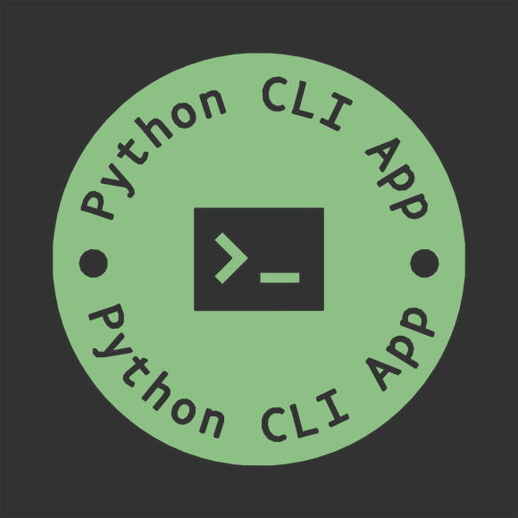

# ​python-cli-app-template

Python project featuring the modern and extensible Python project manager hatch.

Read [Features] for overview.

## Navigation

Documentation for specific `MAJOR.MINOR` versions can be chosen by using the dropdown on the top of every page.
The `dev` version reflects changes that have not yet been released. Shortcuts can be used for navigation, i.e.
<kbd>,</kbd>/<kbd>p</kbd> and <kbd>.</kbd>/<kbd>n</kbd> for previous and next page, respectively, as well as
<kbd>/</kbd>/<kbd>s</kbd> for searching.

[Features]: features.md
